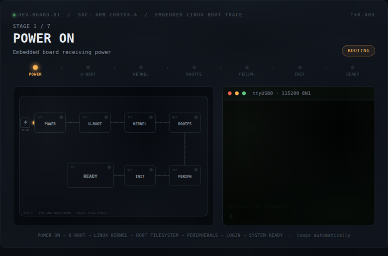

#  i.MX6QDL Sabre-SD Boot LED

A dual-implementation educational project that simulates the boot LED sequence of the **i.MX6QDL Sabre-SD** development board through both console-based (C) and graphical (Python/Tkinter) interfaces.


### Embedded Linux Boot Process

The following animation demonstrates the Linux boot sequence:

**Power ON → U-Boot → Linux Kernel → Root Filesystem → Peripherals → Login → System Ready**




##  Overview

This project provides a **visual simulation** of the 16-stage boot process used in the **i.MX6QDL Sabre-SD** development board. It demonstrates how embedded systems use LED indicators to show boot progression, making it an excellent educational tool for:
- Embedded systems students
- Linux boot process learners
- Embedded Linux developers
- Hardware simulation enthusiasts

##  Features

###  C Program (`imx6qdl_sabre_led`)
- Console-based ASCII art LED display
- Configurable boot speed
- Verbose mode for detailed stage information
- Lightweight, no dependencies
- Cross-platform compatible

###  Python GUI (`led_gui.py`)
- Interactive 4x4 LED grid visualization
- Real-time status display with descriptions
- Speed control slider (1x to 10x)
- Pause/Resume functionality
- Manual step-by-step progression
- Stage highlighting with color coding

## 🔢 Boot LED Sequence

The simulation follows a realistic 16-stage boot sequence:

| Stage | LEDs | Description | Status |
|-------|------|-------------|--------|
| **1. Power ON** | **LED0** | Initial power-up and hardware initialization | 🔴→🟢 |
| **2. U-Boot Stage** | **LED1–LED4** | Bootloader initialization (4 phases) | 🔴→🟢 |
| **3. Kernel Boot** | **LED5–LED8** | Linux kernel loading and initialization | 🔴→🟢 |
| **4. RootFS Mount** | **LED9–LED11** | Root filesystem mounting (3 phases) | 🔴→🟢 |
| **5. Services Init** | **LED12–LED14** | Service initialization (Wi-Fi/Bluetooth/Ethernet) | 🔴→🟢 |
| **6. System Ready** | **LED15** | System fully booted and ready | 🔴→🟢 |

##  Project Structure

```
imx6qdl-sabresd/
├── README.md                    # This file
├── imx6qdl_sabre_led.c         # C console implementation
├── led_gui.py                  # Python GUI implementation
├── Makefile                    # Compilation script for C program
├── imx6qdl_sabre_led          # Compiled binary (after make)
└── (generated files after compilation)
```

##  Quick Start

### Prerequisites

**For Python GUI:**
```bash
sudo apt update
sudo apt install python3 python3-tk
```

**For C Program:**
```bash
sudo apt update
sudo apt install gcc make
```

### Run Python GUI (Recommended for first-time users)
```bash
python3 led_gui.py
```

### Compile and Run C Program
```bash
make
./imx6qdl_sabre_led
```

##  Usage

### Python GUI Application

Launch the GUI with:
```bash
python3 led_gui.py
```

**GUI Controls:**
- **Start/Stop Button**: Begin or halt the simulation
- **Speed Slider**: Adjust boot speed (1-10)
- **Step Button**: Manually progress through stages
- **Reset Button**: Return to initial state
- **LED Grid**: Visual 4x4 display showing active LEDs

**Visual Indicators:**
- 🔴 Red: Stage not yet reached
- 🟢 Green: Active/current stage
- 🟡 Yellow: Completed stage
- 🔵 Blue: Service initialization stages

### C Console Program

**Basic Usage:**
```bash
./imx6qdl_sabre_led
```

**Command Line Options:**
```bash
./imx6qdl_sabre_led [OPTIONS]

Options:
  -h, --help      Show this help message
  -s, --speed=N   Set delay between stages (1=fast, 10=slow, default=3)
  -v, --verbose   Show detailed status messages
  -q, --quiet     Minimal output (only LEDs)
```

**Examples:**
```bash
# Fast boot with details
./imx6qdl_sabre_led --speed=1 --verbose

# Slow, minimal display
./imx6qdl_sabre_led --speed=8 --quiet

# Default settings
./imx6qdl_sabre_led
```

##  Build Instructions

### Compile C Program
```bash
# Clean build
make clean

# Compile
make

# Optional: Install to system (requires sudo)
sudo make install
```

### Manual Compilation
```bash
gcc -o imx6qdl_sabre_led imx6qdl_sabre_led.c -Wall -Wextra -std=c99
```

### Makefile Targets
```bash
make           # Compile program
make clean     # Remove compiled files
make install   # Install to /usr/local/bin
make uninstall # Remove from system
make debug     # Compile with debug symbols
```

##  LED Mapping Visualization

The 16 LEDs are logically arranged in a 4x4 grid:

```
┌─────┬─────┬─────┬─────┐
│ LED0│ LED1│ LED2│ LED3│  ← Row 1: Power & U-Boot
├─────┼─────┼─────┼─────┤
│ LED4│ LED5│ LED6│ LED7│  ← Row 2: U-Boot & Kernel
├─────┼─────┼─────┼─────┤
│ LED8│ LED9│ LED10│LED11│ ← Row 3: Kernel & RootFS
├─────┼─────┼─────┼─────┤
│ LED12│LED13│LED14│LED15│ ← Row 4: Services & Ready
└─────┴─────┴─────┴─────┘
```

##  Detailed Workflow

### Simulation Flow
1. **Initialization**: All LEDs off (red)
2. **Stage Progression**: Each stage activates its LED(s)
3. **Status Updates**: Console/GUI updates with stage info
4. **Completion**: All LEDs active, system ready message

### C Program Flow
```c
main() → parse_args() → initialize() → simulate_boot() → cleanup()
           ↓                ↓              ↓                ↓
       Read options    Setup display   Loop through    Free resources
                                        16 stages
                                          ↓
                                    update_led() + delay()
```

### Python GUI Flow
```python
LEDSimulator() → __init__() → create_widgets() → start_simulation()
     ↓                ↓              ↓                  ↓
 Application      Initialize    Build GUI        Run boot sequence
                                            ↓
                                  update_leds() + schedule_next()
```

##  Testing

**Quick Test Suite:**
```bash
# Test C program
./imx6qdl_sabre_led --speed=2 --verbose
./imx6qdl_sabre_led --speed=5 --quiet

# Test Python GUI
python3 led_gui.py

# Test both implementations
chmod +x test.sh  # If test script exists
./test.sh
```

**Expected Output Examples:**

**C Program:**
```
[  ] LED0  [  ] LED1  [  ] LED2  [  ] LED3
[  ] LED4  [  ] LED5  [  ] LED6  [  ] LED7
[  ] LED8  [  ] LED9  [  ] LED10 [  ] LED11
[  ] LED12 [  ] LED13 [  ] LED14 [  ] LED15

Starting boot sequence...
Stage 0: Power ON - LED0
[ON] LED0  [  ] LED1  [  ] LED2  [  ] LED3
...
```

**Python GUI:**
- Interactive window with 4x4 LED grid
- Status bar showing current stage
- Control panel with buttons and slider

##  Customization

### Modify Boot Parameters

**In C program:**
```c
// Edit imx6qdl_sabre_led.c
#define DEFAULT_SPEED 3        // Change default speed
#define TOTAL_STAGES 16        // Number of LEDs
const char* stage_names[] = {  // Edit stage descriptions
    "Power ON",
    "U-Boot Phase 1",
    // ... etc
};
```

**In Python GUI:**
```python
# Edit led_gui.py
STAGE_DESCRIPTIONS = {
    0: "Power ON - Hardware Initialization",
    1: "U-Boot Phase 1 - CPU Init",
    # ... etc
}
COLORS = {
    'off': '#ff4444',     # Change LED colors
    'on': '#44ff44',
    'active': '#ffff44'
}
```

### Add New Features

1. **Add sound effects**: Integrate with `pygame` or system beep
2. **Logging**: Add file logging for boot sequence
3. **Network simulation**: Simulate network service initialization
4. **Web interface**: Create Flask/Django web version

##  Contributing

Contributions are welcome! Here's how you can help:

1. **Fork** the repository
2. **Create a feature branch**: `git checkout -b feature/amazing-feature`
3. **Commit changes**: `git commit -m 'Add amazing feature'`
4. **Push to branch**: `git push origin feature/amazing-feature`
5. **Open a Pull Request**

### Development Guidelines
- Follow existing code style
- Add comments for complex logic
- Update documentation
- Test changes on both implementations
- Keep commits focused and atomic

### Suggested Improvements
- [ ] Add error simulation mode
- [ ] Create web-based version
- [ ] Add real hardware integration
- [ ] Create Docker container
- [ ] Add unit tests
- [ ] Internationalization support

##  Educational Value

This project demonstrates:
- **Embedded boot sequences**: How hardware indicates boot progress
- **Multi-language implementation**: Same logic in C and Python
- **Event-driven programming**: GUI event handling
- **System simulation**: Modeling real hardware behavior
- **Cross-platform development**: Works on Linux, macOS, Windows

##  Troubleshooting

| Issue | Solution |
|-------|----------|
| `python3-tk not found` | `sudo apt install python3-tk` (Debian/Ubuntu) |
| `make: command not found` | `sudo apt install make` |
| `gcc: command not found` | `sudo apt install gcc` |
| GUI window doesn't open | Check DISPLAY variable, try `export DISPLAY=:0` |
| Program runs too fast/slow | Use `-s` option to adjust speed |


##  Acknowledgments

- **Freescale/NXP** for i.MX6QDL Sabre-SD board documentation
- **Python Software Foundation** for Tkinter
- **GCC team** for the C compiler
- **Embedded Linux community** for boot sequence references

##  Support & Contact

- **Questions**: Open a discussion in GitHub

##  Star History

If you find this project useful, please consider giving it a star! ⭐

---

